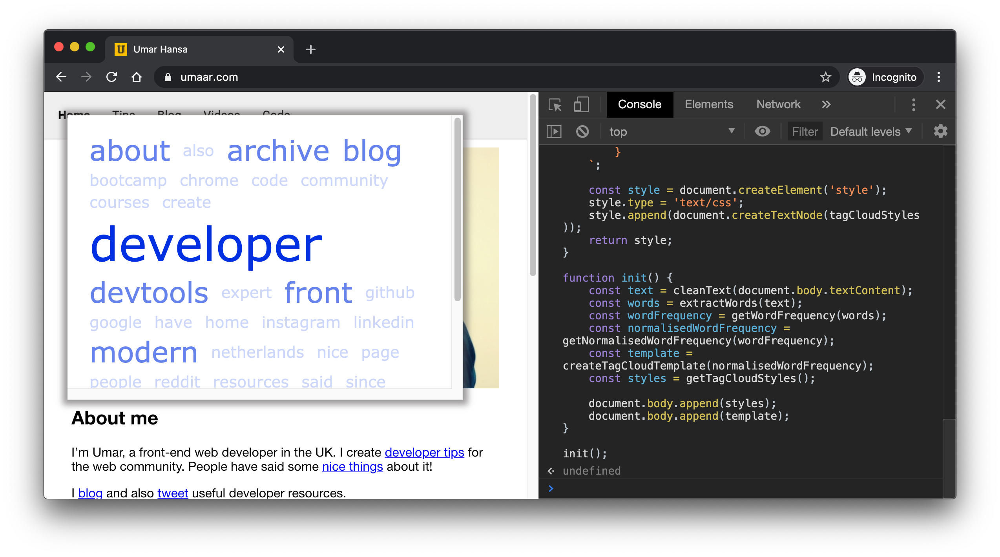

### Wordcloud

Instructions to use this bookmarklet: copy the contents of the [`index.js`](https://github.com/umaar/wordcloud/blob/master/index.js) file and paste it in your Devloper Tools console on a page with a bunch of text on it.

When executed, this code overlays a modal which displays the "tag cloud" containing words greater than three characters in length.
